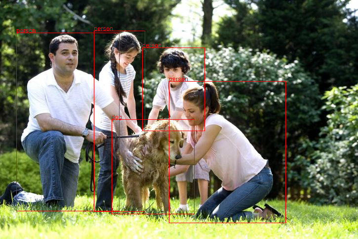

# java-ssd-object-detection

Image SSD object detection in pure Java using Tensorrflow

This project is a derivation from the tensorflow [object detection](https://github.com/tensorflow/models/tree/master/samples/languages/java/object_detection)
codes but makes it easy to integrate with other java application

# Install

To install, add the following dependency to your POM file:

```xml
<dependency>
  <groupId>com.github.chen0040</groupId>
  <artifactId>java-ssd-object-detection</artifactId>
  <version>1.0.1</version>
</dependency>
```


# Usage

The [sample codes](src/main/java/com/github/chen0040/objdetect/ObjectDetectorDemo.java) below shows how to detect 
objects in an image using the [ObjectDetector](src/main/java/com/github/chen0040/objdetect/ObjectDetector.java) 
class:

```java
import com.github.chen0040.objdetect.models.DetectedObj;

import javax.imageio.ImageIO;
import java.awt.image.BufferedImage;
import java.io.File;
import java.util.List;

public class ObjectDetectorDemo {
    public static void main(String[] args) throws Exception {
        ObjectDetector detector = new ObjectDetector();

        detector.loadModel();

        BufferedImage img = ImageIO.read(new File("images/test.jpg"));

        List<DetectedObj> result = detector.detectObjects(img);

        System.out.println("There are " + result.size() + " objects detected");
        for(int i=0; i < result.size(); ++i){
            System.out.println("# " + (i + 1) + ": " + result.get(i));
        }
        
        BufferedImage img2 = detector.drawDetectedObjects(img);
        ImageIO.write(img2, "PNG", new File("images/test_output.png"));
    }
}
``` 

Below shows the result of the test_output.png generated:


